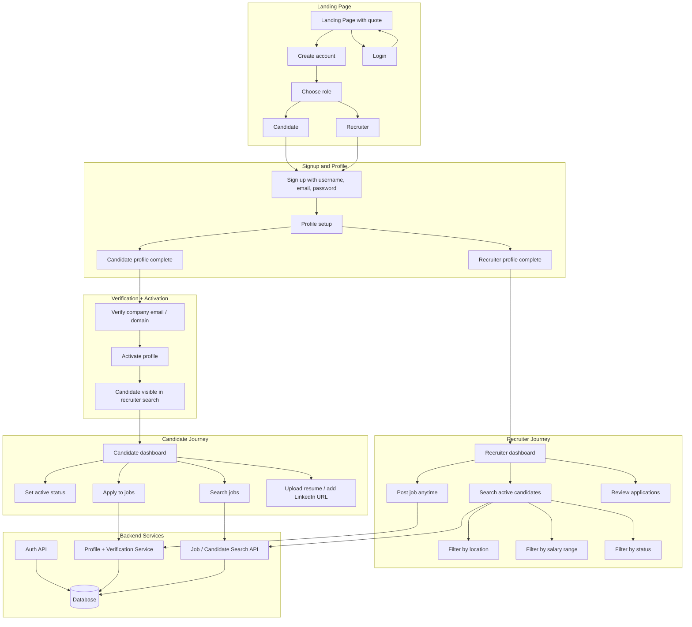

# Zero Notice Period Platform - Site Flow

This diagram describes the platform flow for a marketplace where laid-off professionals and recruiters connect for immediate join roles.

## Key Requirements

- Landing page must communicate the zero-notice mission with a motivating quote.
- Users must sign up first, then complete their profile, then use the dashboard.
- Candidates must activate their profile to appear in recruiter search results.
- Recruiters can post jobs anytime after login.
- Candidate statuses should include: `Immediate Joiner`, `Actively Looking`, `Placed but Open`.
- Candidate profiles should support email/company domain verification to establish genuineness.
- Recruiters should search candidates by location, salary range, and availability status.
- The product must remain distinct from LinkedIn/Naukri, focusing on immediate, simple hiring.
- Provide a jobs section that candidates can apply to directly.
- Allow optional LinkedIn URL for candidate credibility and recruiter trust.
- Only active candidates should appear in search results for recruiters.
